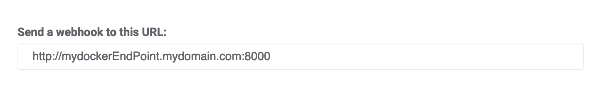

# Gotelnyxsms
gotelnyxsms is a very simple API service to receive an SMS from telnyx.com using their incoming webhook feature and send the content via slack.

The steps to make it works are:

### Create an Slack APP and configure an incoming webhook to a Slack channel

HOW TO: https://api.slack.com/messaging/webhooks 

### Replace Slack webhook URL

Edit **main.go** and modify the variable **webhookUrl** accordingly

### Build and run the container

docker build -t telnyxsms .
docker push telnyxsm

### Configure Telnyx Webhook SMS

Login in portal.telnyx.com
Go to Messaging menu
Select your Messaging profile
Configure the incoming webhook:

### Improvements

Well, there are a lot. Contact me or create a PR.